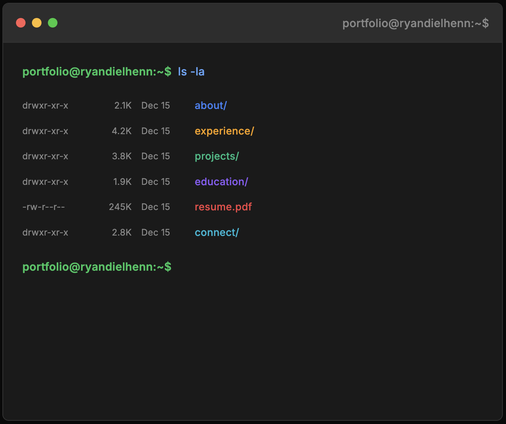

# Terminal-Themed Portfolio

**Live site:** [ryandielhenn.github.io](https://ryandielhenn.github.io)

<p align="center">
  
</p>

## Local Development

```bash
git clone https://github.com/ryandielhenn/ryandielhenn.github.io.git
cd ryandielhenn.github.io
npm install
npm run dev
```
